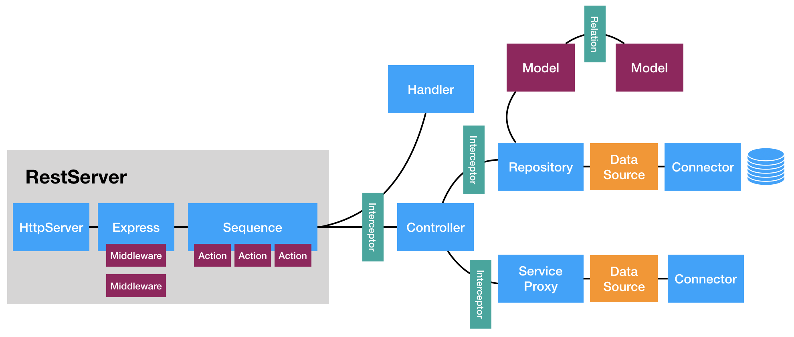
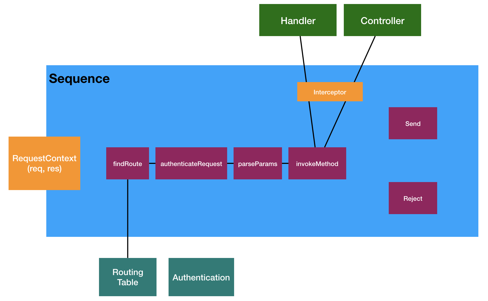

## The LoopBack 4 request-response cycle

To understand the LoopBack 4 request-response cycle, let's start by enumerating
the APIs that create the endpoints on the server. We will then follow the path
taken by a request, to see how it makes its way through the various parts of the
framework to return a result.

### Setting up the request-responses infrastruture

The endpoints on a LoopBack app can be categorized into controller endpoints and
non-controller endpoints. Controller endpoints are those that are created by
LoopBack controller methods, non-controller endpoints are those that are created
by other APIs.

#### Controller endpoints

Controller methods decorated with operation decorators like `@get()`, `@post()`,
`@put` etc., create enpoints on the app for the corresponding HTTP verbs. The
behavior of these endpoints are entirely dependent on the implementation of the
controller method.



In the request-response cycle section we will see how implemenation details
determine the course of a request these endpoints - they may or may not actually
interact with a model.

#### Non-controller endpoints

The following APIs can create non-controller endpoints.

##### 1. app.static(path, rootDir, options)

This method maps to the underlying Express' [static](https://expressjs.com/en/4x/api.html#express.static)
method. It creates dynamic enpoints for files in the `rootDir` to be servered
at `path`.

More details at [RestApplication.static()](https://loopback.io/doc/en/lb4/apidocs.rest.restapplication.static.html)
doc.

##### 2. app.redirect(fromPath, toPathOrUrl, statusCode)

This method redirects requests to `fromPath` to `toPathOrUrl` with the status
code `statusCode`.

More details at [RestApplication.redirect()](https://loopback.io/doc/en/lb4/apidocs.rest.restapplication.redirect.html)
doc.

##### 3. app.mountExpressRouter(basePath, router, spec)

This method mounts an Express [router](https://expressjs.com/en/4x/api.html#router)
in the LoopBack app. You can use it for adding custom enpoints in your app using
the Express middleware format.

More details at [RestApplication.mountExpressRouter()
](https://loopback.io/doc/en/lb4/apidocs.rest.restapplication.mountexpressrouter.html) doc.

##### 4. non-controller endpoints added by components

[Components](https://loopback.io/doc/en/lb4/Components.html) are the extension
units of LoopBack. Since they can access the LoopBack app instance, the request
and response instances using [dependency injection](https://loopback.io/doc/en/lb4/Dependency-injection.html),
they are capable of adding new endpoints and determining the result of a request.

### The request-response cycle

The request-response cycle involves many components, especially if the request
is to a controller-endpoint which interacts with a model.

The request handling process starts with the app's [sequence](https://loopback.io/doc/en/lb4/Sequence.html);
it is the gatekeeper of all requests to the app. Every request, whether to
controller endpoints or non-controller endpoints, must pass through the sequence.

The sequence identifies the responsible handlers for the requested endpoint and
passes on the request to the handlers. The handlers then take care of sending
the response back to the client.

#### The sequence

The sequence is a simple class with five injected helper methods. These five
methods come together in the sequence class to make the request-response cycle
possible in LoopBack.



##### 1. FindRoute

Finds the appropriate endpoint (route or controller method, spec and args) for
invocation. If no endpoint is fount, it throws an error.

https://loopback.io/doc/en/lb4/apidocs.rest.findrouteprovider.html

##### 2. ParseParams

https://loopback.io/doc/en/lb4/apidocs.rest.parseparamsprovider.html

##### 3. InvokeMethod

https://loopback.io/doc/en/lb4/apidocs.rest.invokemethodprovider.html

##### 4. Send

Responsible for sending the

https://loopback.io/doc/en/lb4/apidocs.rest.sendprovider.html

##### 5. Reject

Responsible for sending error back to the client in case any of the above helper
methods throw or encounter any errors.

https://loopback.io/doc/en/lb4/apidocs.rest.rejectprovider.html

#### Request to a controller endpoint

[TODO: explain]

- How controller methods work with various types of services
- How controller methods work with repositories (and datasource) to get/set
model data
- What are interceptors and how they can affect the req-res cycle
- Walk through a single REST API

#### Request to a non-controller endpoint

[TODO: explain]

- How requests to non-controller endpoints are handled
  - static files
  - redirection
  - custom Express routes
  - non-controller endpoints added by components
